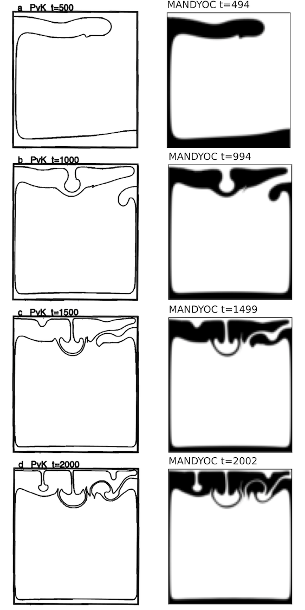
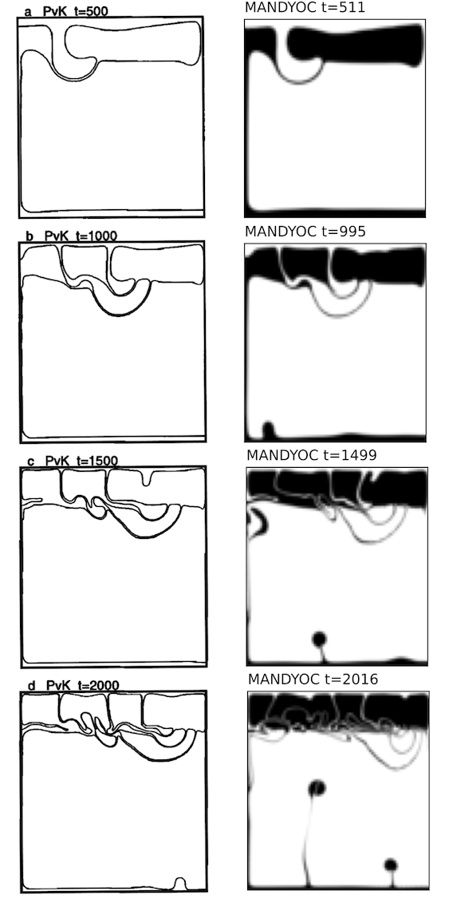
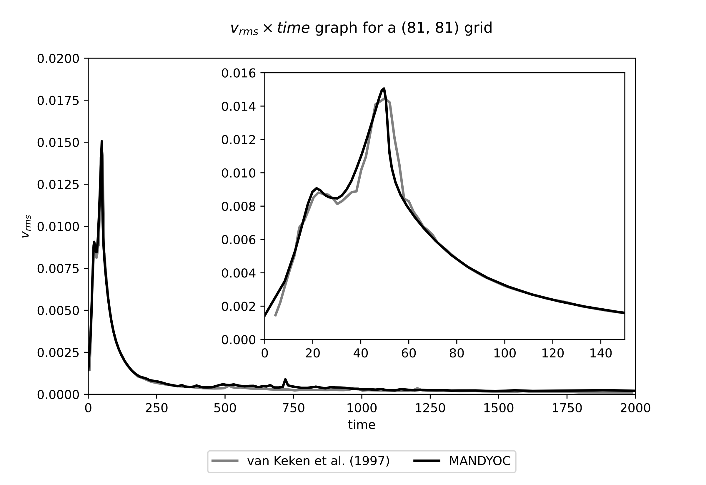

.. _benchmarks:

Benchmarks
==========

In order to test the accuracy of the *Mandyoc* code, its results can be compared to benchmark studies. The following subsections will present the procedures and results for some well established modeling problems. Such cases should provide information about the applicability and performance of the code as well as some of its limitations.

van Keken et al. (1997) :cite:`vankeken1997`
--------------------------------------------

The set of simulations proposed by van Keken et al. (1997) :cite:`vankeken1997` compares several methods of studying two dimensional thermochemical convection, where the Boussinesq approximation and infinite Prandtl number are used.

For this benchmark, the first case is presented with the three distinct variations, as proposed by the article. The simulation consists of two layers, where a buoyant thin layer is under a denser thicker package. The problem can be interpreted as a salt layer under a sediment package, and the interface between the layers is defined by the :eq:`interfacerayleigh` below.

.. math::
    :label: interfacerayleigh

    y=-0.8 \lambda_y + 0.02 \cos{\frac{\pi x }{\lambda_x}}

where :math:`\lambda_x` and :math:`\lambda_y` are the horizontal and vertical lengths of the simulated 2-D box, respectively.

The simulations are carried out in a Cartesian box where the fluid is isothermal and Rayleigh-Taylor instability is expected for the proposed setup. The table below lists the parameters used to run this scenario together with the distinction between the three proposed simulation (*case 1a*, *1b* and *1c*).

.. list-table:: Parameters used for the Rayleigh-Taylor instability simulation.
    :header-rows: 1
    :widths: 30 20 20
    :align: center

    * - Parameter
      - .. centered:: Symbol
      - Value
    * - Horizontal length
      - .. centered:: :math:`\lambda_x`
      - 1.0000
    * - Vertical length
      - .. centered:: :math:`\lambda_y`
      - 0.9142
    * - Thermal diffusion coefficient
      - .. centered:: :math:`\kappa`
      - :math:`1.0\times 10^{-6}`
    * - Gravity acceleration
      - .. centered:: :math:`g`
      - :math:`10`
    * - Reference viscosity
      - .. centered:: :math:`\eta_r`
      - :math:`1.0\times 10^{21}`
    * - Buoyant layer viscosity
      - .. centered:: :math:`\eta_0`
      - | :math:`1.00\times\eta_r` (case 1a)
        | :math:`0.10\times\eta_r` (case 1b)
        | :math:`0.01\times\eta_r` (case 1c)

Results for *case 1a*
*********************

For the *case 1a* where :math:`\eta_0/\eta_r=1.00`, :numref:`vankekenCase1aEvolution` below compares the evolution of the isoviscous Rayleigh-Taylor instability between the van Keken et al. (1997) :cite:`vankeken1997` and the *Mandyoc*. The time steps shown for the *Mandyoc* code are the closest the simulation could provide, considering the chosen simulation parameters. 

.. _vankekenCase1aEvolution:

  Evolution of the isoviscous Rayleigh-Taylor instability for :math:`\eta_0/\eta_r=1.00`. The best result presented by van Keken et al. (1997) :cite:`vankeken1997` are on the left and the *Mandyoc* results are on the right.

:numref:`vankekenCase1aGraph` below compares the change of the :math:`v_{rms}` with time, showing the results from van Keken et al. (1997) :cite:`vankeken1997` in gray and *Mandyoc* in black.

.. _vankekenCase1aGraph:

.. figure:: figs/vrms-1a.png
  :align: center
  :width: 100%
  :alt: Results

  Evolution of the :math:`v_{rms}` for :math:`\eta_0/\eta_r=1.00`. The van Keken et al. (1997) :cite:`vankeken1997` result is shown in black and the *Mandyoc* code result is shown in gray.

Results for *case 1b*
*********************

For the *case 1b* where :math:`\eta_0/\eta_r=0.10`, :numref:`vankekenCase1bEvolution` compares the evolution of the isoviscous Rayleigh-Taylor instability between van Keken et al. (1997) :cite:`vankeken1997` and *Mandyoc*. The time steps shown for the *Mandyoc* code are the closest the simulation could provide, considering the chosen simulation parameters. 

.. _vankekenCase1bEvolution:

  Evolution of the isoviscous Rayleigh-Taylor instability for :math:`\eta_0/\eta_r=0.10`. The best result presented by van Keken et al. (1997) :cite:`vankeken1997` are on the left and the *Mandyoc* results are on the right.

.. note::
  Because of the different methods used by van Keken et al. (1997) :cite:`vankeken1997` and *Mandyoc*, the *Mandyoc* results for the evolution of the isoviscous Rayleigh-Taylor instability presents its data colored instead of contoured.

:numref:`vankekenCase1bGraph` below compares the change of the :math:`v_{rms}` with time, showing the results from van Keken et al. (1997) :cite:`vankeken1997` in gray and *Mandyoc* in black.

.. _vankekenCase1bGraph:

.. figure:: figs/vrms-1b.png
  :align: center
  :width: 100%
  :alt: Results

  Evolution of the :math:`v_{rms}` for :math:`\eta_0/\eta_r=0.10`. The van Keken et al. (1997) :cite:`vankeken1997` result is shown in black and the *Mandyoc* code result is shown in gray.

Results for *case 1c*
*********************

For the *case 1c* where :math:`\eta_0/\eta_r=0.01`, :numref:`vankekenCase1cEvolution` compares the evolution of the isoviscous Rayleigh-Taylor instability between van Keken et al. (1997) :cite:`vankeken1997` and *Mandyoc*. The time steps shown for the *Mandyoc* code are the closest the simulation could provide, considering the chosen simulation parameters. 

.. _vankekenCase1cEvolution:

.. figure:: figs/vankeken-snaps-1c.png
  :align: center
  :width: 80%
  :alt: Results

  Evolution of the isoviscous Rayleigh-Taylor instability for :math:`\eta_0/\eta_r=0.01`. The best result presented by van Keken et al. (1997) :cite:`vankeken1997` are on the left and the *Mandyoc* results are on the right.

:numref:`vankekenCase1cGraph` below compares the change of the :math:`v_{rms}` with time, showing the results from van Keken et al. (1997) :cite:`vankeken1997` in gray and *Mandyoc* in black.

.. _vankekenCase1cGraph:

  Evolution of the :math:`v_{rms}` for :math:`\eta_0/\eta_r=0.01`. The van Keken et al. (1997) :cite:`vankeken1997` result is shown in black and the *Mandyoc* code result is shown in gray.
