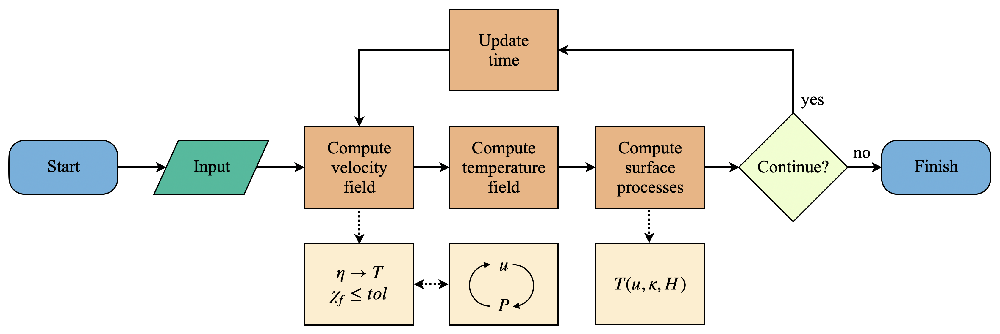

.. _basictheory:

Basic theory
============

The *Mandyoc* code simulates thermochemical convection of the Earth's mantle. The following sections explain which equations are being solved by the code and the numerical approach that was used.

Basic equations
---------------

To simulate mantle thermochemical convection, we adopted the formulation for non-Newtonian fluids together with the Boussinesq approximation to solve the following equations of conservation of mass (:eq:`mass-conservation`), momentum (:eq:`momentum-conservation`) and energy (:eq:`energy-conservation`) :cite:`zhong2007`.

.. math:: 
	:label: mass-conservation

	u_{i,i}=0 

.. math:: 
	:label: momentum-conservation

	\sigma_{ij,j}+g_{i}\rho_{0}(1-\alpha(T-T_{0}))=0

.. math::
	:label: energy-conservation

	\frac{\partial T}{\partial t} + u_{i}T_{,i}=\kappa T_{,ii} + \frac{H}{c_p}-\frac{\alpha T g u_{e}}{c_{p}}
  
where :math:`u` is the velocity in the :math:`i` direction, :math:`g` is the gravity acceleration, :math:`\rho_{0}` is the reference rock density at temperature :math:`T_0`, :math:`\alpha` is the coefficient of volumetric expansion, :math:`T` is the temperature, :math:`\kappa` is the thermal diffusivity, :math:`H` is the rate of radiogenic heat per unit of mass, :math:`c_{p}` is the specific heat, :math:`\delta_{ij}` is the Kronecker delta, and :math:`\sigma_{ij}` is the stress tensor:

.. math::
	:label: stress-tensor

	\sigma_{ij}=-P\delta_{ij}+\eta (u_{i,j}+u_{j,i})

where :math:`P` is the dynamic pressure and :math:`\eta` is the effective viscosity of the rock.

.. note::
	For the adopted Einstein notation, repeated indexes in the same term represent summation and indexes after comma are partial derivative to a spatial coordinate.

Numerical approach
------------------

The equations of conservation of mass, momentum and energy are solved using the finite element method :cite:`zhong2007`. *Mandyoc* uses hexahedral elements for three dimensional grids and quadrilateral elements for two dimensional grids :cite:`hughes2012`. The :ref:`massmomentumimplementation` subsection presents the numerical methods used to solve the mass and momentum equations and the :ref:`energyimplementation` subsection shows how an implicit formulation was used to solve the energy equation :cite:`braun2003`.

To simulate any scenario, the user **must** provide the parameter file ``param.txt`` and, if necessary, the ASCII files with the initial temperature field, velocity field and/or the initial interfaces of the model. To see how these files can be created/modified, see the section :ref:`parameterfile` and :ref:`inputfiles`. The flowchart in :numref:`mandyocscheme` summarizes the steps *Mandyoc* takes to solve the conservation equations and perform a simulation.

.. _mandyocscheme:

	Flowchart showing the steps *Mandyoc* takes to solve the equations of conservation of mass, momentum and energy.
	
:numref:`mandyocscheme` shows that once the code starts running and the input files are read (``param.txt`` and the ASCII input files), *Mandyoc* uses the effective viscosity field :math:`\eta` (:eq:`effective-eta`) to calculate the velocity field :math:`u` and checks if the convergence condition satisfies the tolerance :math:`tol` as shown in :eq:`tol` :cite:`thieulot2014`.

.. math::
	:label: tol

	\chi_{f}=1-\frac{(\langle f^{i}- \langle f^{i} \rangle \rangle)\cdot (\langle f^{i+1}- \langle f^{i+1} \rangle \rangle)}{|\langle f^{i}- \langle f^{i} \rangle \rangle|\cdot |\langle f^{i+1}- \langle f^{i+1} \rangle \rangle|}\leq tol

where :math:`f` is a vector with the components of the velocity :math:`u` at all mesh nodes, :math:`i` is the iteration number, the :math:`\langle f \rangle` represents the mean value of :math:`f`, and :math:`tol` is the tolerance parameter.

While the minimum tolerance is not reached, *Mandyoc* utilizes the Uzawa's method to iteratively calculate new :math:`u` and :math:`P` fields. The updated fields modify the viscosity field :math:`\eta`, which in turn disturbs the velocity field again. These fields are updated until tolerance is reached. By default, the tolerance value for *Mandyoc* is :math:`10^{-6}`.

Additionally, the compositional factor :math:`C` is evaluated for an advection as in the equation below. Its solution is calculated placing randomly a number of particles within each finite element of the mesh, which are displaced based on the adjacent node velocity values :cite:`tackley2003`. The individual value for each particle is obtained by linear interpolation of the node values.

.. math::
	:label: advection

	\frac{\partial C}{\partial t} + u_{i}C_{,i} = 0 

Once the velocity field is solved, *Mandyoc* computes the temperature field as a function of the :math:`u`, :math:`\kappa` and :math:`H`. In the next steps, the surface processes are computed and if the maximum time step or the maximum simulation time was not reached, the code updates the time and goes back to compute a new velocity field.
